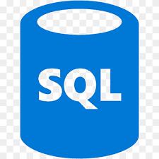

<h1 align="center">Hello, we are Lobotomy Corp!</h1>

<h3 align="left">About:</h3>

A team of indie developers from St. Petersburg(Founding date: June 13, 2024)

<h3 align="left">Connect with me:</h3>

PR

Accord-F

<h3 align="left">Languages:</h3>

<h3 align="left">Frameworks:</h3>
<h3 align="left">Tools:</h3>

<h3>Our projects: </h3>
<ul>
  <li>
SDF-Mini
</li>
</ul>
